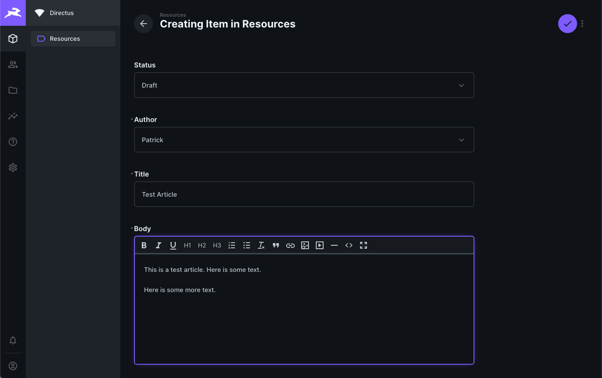

# Admin Resource Manager

## Overview

We would like to add a Resources directory to the web app. This will be available to all registered users, and will host articles on various topics. 

## Requirements

1. The web app requires a new page called "Resources" that acts as an article directory
2. The web app should be able to apply consistent formatting to articles
3. Non-technical users should be able to add, edit, and delete articles without help from developers
4. The way in which articles are stored should be portable and future-proof

## Proposal

[Directus](https://directus.io/) is a free and open-source content management system that can be used on top of our existing database. Because Directus makes no changes to the structure of the database, it remains possible to switch out parts of our tech stack in future without issue.

To add, edit, or remove articles from the Resources page, administrators use the Directus dashboard:

This is hosted on Heroku along with the main app, but is only accessible to administrators with a login/password.

## Tasks and time estimates

1. Add additional tables to the database to store articles -- **half a day**
2. Add a Resources page to the web app (this should include filtering and sorting functionality). -- **two days**
3. Decide how articles should be formatted when displaying. -- **n/a if offloaded**
4. Implement article formatting. -- **one day**
5. Implement Directus CMS and dashboard. -- **three days**
6. Testing and troubleshooting. -- **two days**

Total time estimate: 8.5 days